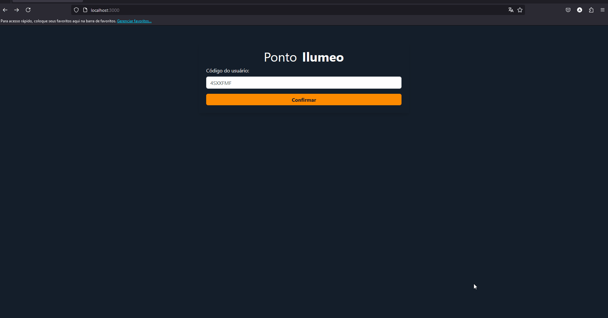
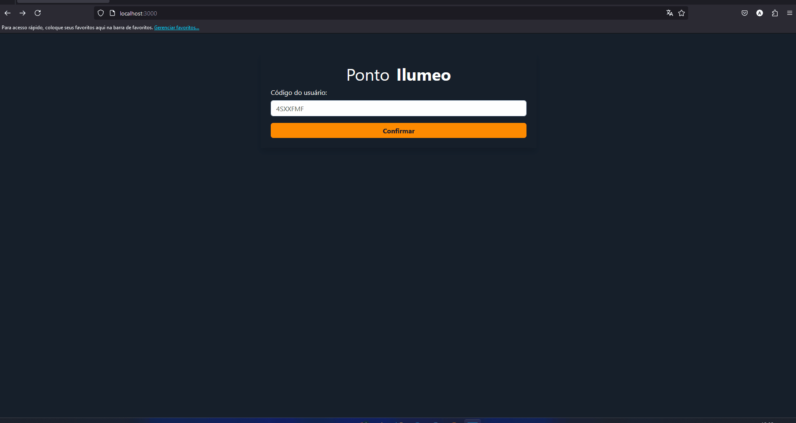
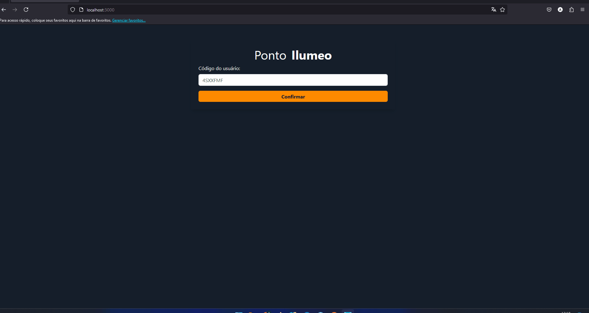
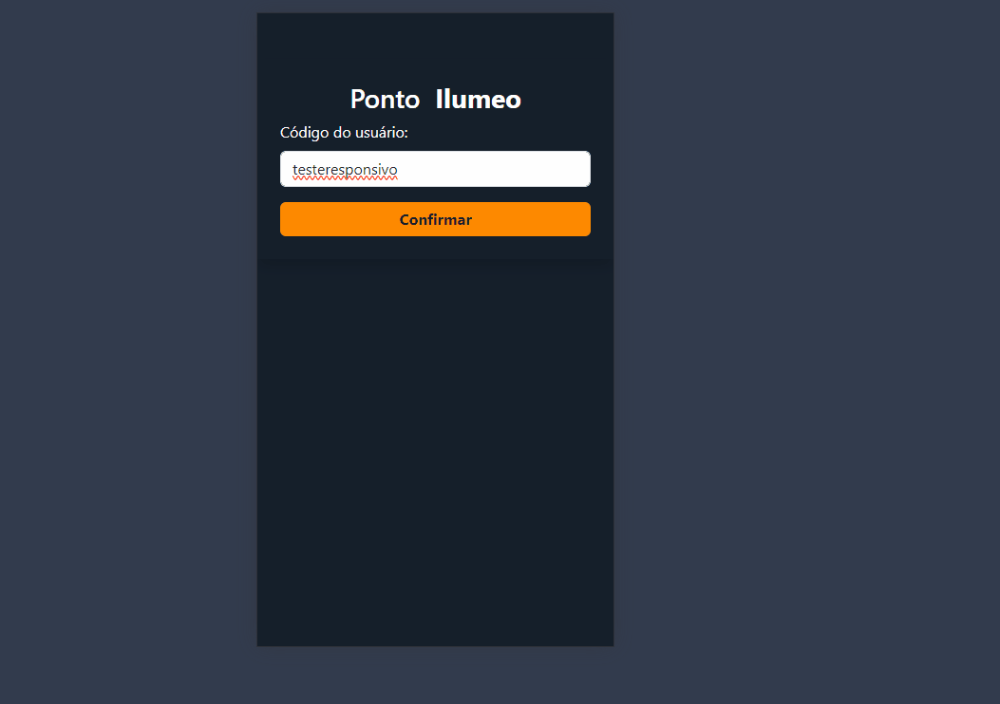

# sistema-de-controle-de-pontos

## Descrição

Este repositório contém uma aplicação de controle de ponto desenvolvida em Node.js e React usando TypeScript. A aplicação permite o registro de entrada e saída, simulando a entrada e saída de colaboradores em uma empresa. Ela também lista a quantidade de horas trabalhadas em dias anteriores e possui um modal que exibe o histórico de registros do dia.

Por se tratar de uma aplicação voltada para funcionalidades de controle de ponto, qualquer ID ou matrícula utilizada no login funcionará. Se o ID ou matrícula existir, os dados serão obtidos corretamente; caso contrário, serão criados.

## Deploy
O deploy do backend da aplicação foi realizado no Render, que oferece uma estrutura que permite criar um banco de dados PostgreSQL. O frontend, por sua vez, está no Vercel.

Importante: Devido ao uso do plano gratuito no Render e Vercel, o servidor fica em stand by e só é ativado com a primeira requisição. Portanto, as ações iniciais na aplicação podem demorar mais do que o habitual.

Frontend: https://sistema-de-controle-de-pontos.vercel.app/

Backend: https://sistema-de-controle-de-pontos.onrender.com/

Protótipo no Figma: https://www.figma.com/design/Krnz9hBdkGoOyYmL2zl0J6/Ilumeo---Teste-Fullsatck

Para testar a aplicação com resgitro em dias anteriores utilize Código do usuário: `4sxxfmf` 

### Tecnologias Utilizadas
- **Node.Js**
- **React.JS**
- **Postgres**
- **Jest**
- **Typescript**
- **Docker**

### Funcionalidades
- **Login**: Permite ao usuário inserir seu ID ou matrícula para acessar a aplicação.
- **Registro de entrada e saída**: Permite ao usuário registrar suas entradas e saídas do trabalho.
- **Timer**: O timer permite visualizar a quantidade de horas trabalhadas no dia de forma atualizada. Ao registrar uma entrada, o timer começará a contar as horas, minutos e segundos trabalhados no dia, até que um horário de saída seja registrado.
- **Histórico**: Ao clicar no ícone de 'olho', será aberto um modal com o histórico de registros do dia. (Os registros de entrada e saída são inseridos em conjunto; ou seja, as linhas de registro só serão exibidas quando houver pelo menos uma entrada e uma saída.)
- **Lista de horas trabalhadas nos dias anteriores**: Lista todos os dias anteriores e a quantidade de horas trabalhadas em cada um deles.


## Configuração do projeto
A aplicação é dividida em backend e frontend. Para configurá-la, é possível iniciar usando Docker ou com os scripts separadamente.

### Backend
Com o repositório clonado, entre no diretório `./backend`.

#### Usando docker

1. Construa e inicie os containers docker:
```
docker-compose up
```
Será criado e iniciado o banco de dados PostgreSQL na porta 5432, a API na porta 8080 e também será realizado um seed para popular o banco de dados com informações de um usuário com o ID `4sxxfmf`.


#### Manualmente
Para esta abordagem, é necessário ter o banco de dados PostgreSQL instalado na máquina e também um arquivo com as seguintes variáveis de ambiente:

`PORT=8080` <br/>
`DB_NAME=worked_hours` <br/>
`DB_USER=postgres` <br/>
`DB_PASS=postgres` <br/>
`DB_HOST=localhost` <br/>

1. Instale as dependências:
```
npm install
```

2. Construa a aplicação:

```
npm run build
```
3. Inicie a aplicação:

```
npm start
```

### Frontend
Com o repositório clonado, entre no diretório `./frontend`.

**Importante:** É necessário que o backend já esteja rodando para o correto funcionamento da aplicação.


#### Usando docker

1. Construa e inicie os containers Docker:
```
docker-compose up
```

A aplicação será iniciada na porta `8080`, e já será possível usá-la.

#### Manualmente
Para esta abordagem, é necessário ter um arquivo com as seguintes variáveis de ambiente:

`REACT_APP_API_URL=http://localhost:8080`

1. Instale as dependências:
```
npm install
```

2. Inicie a aplicação:

```
npm start
```


## Como foi resolver o teste ?
### Estrutura

Como o foco principal é o registro de ponto, criei uma estrutura que não valida se o usuário já possui uma matrícula. Caso não exista, uma matrícula será criada.

No backend, foram criadas três rotas:

- **createWorkHours**: Responsável por criar um dia de trabalho no banco de dados.
- **updateInOrOut**: Responsável por atualizar as entradas e saídas do colaborador.
- **getWorkHoursByEmployee**: Responsável por buscar as horas trabalhadas pelo colaborador.

No frontend, criei duas views: uma para login e outra para o registro dos pontos. A view de registro de pontos é mais complexa e conta com alguns componentes adicionais:

- **WorkedHoursDisplay**: Calcula a diferença entre entradas e saídas e exibe as horas trabalhadas no dia.
- **TimerRegister**: Responsável pelo botão de registrar entradas e saídas. Ele valida se o próximo registro será uma entrada ou saída e realiza a ação correta.
- **TimeRecordHistoryModal**: Modal que exibe o histórico de entradas e saídas no dia.
- **ListPreviousWorkedDays**: Responsável por calcular e listar as horas trabalhadas pelo colaborador em dias anteriores.

# Telas e funcionalidades

### Login


### Registro de entrada e saída


### Timer atualizado


### Responsividade



## Notas sobre o Teste

### Problema Conhecido

**Descrição:** Identifiquei um bug relacionado à atualização do timer. Em alguns momentos, são realizadas duas requisições ao backend, sendo que uma delas envia algumas informações vazias. Isso gera uma visualização incorreta do tempo de trabalho.

**Possível Causa:** Isso pode esta ocorrendo devido à mudança de estado de uma variável ou por conta do tempo de inserção de novos registros no banco de dados, gerando múltiplas renderizações ou dados inconsisentes.

**Solução Proposta:** Identificar qual variável está causando essa múltipla renderização e ajustar. Além disso, implementar Redux na aplicação para gerenciar melhor os estados globais.

### Observações

O erro não gera grande impacto na aplicação, pois não ocorre a todo momento e, por ter sido identificado apenas no final dos testes, não terei tempo de aplicar as correções até o prazo determinado. Por isso, deixo essa nota de teste informando sobre o problema conhecido.


Em relação aos testes, implementei testes nos controllers e services da aplicação. No entanto, optei por não implementá-los no frontend, pois ainda estou estudando e aprendendo sobre testes no frontend.

